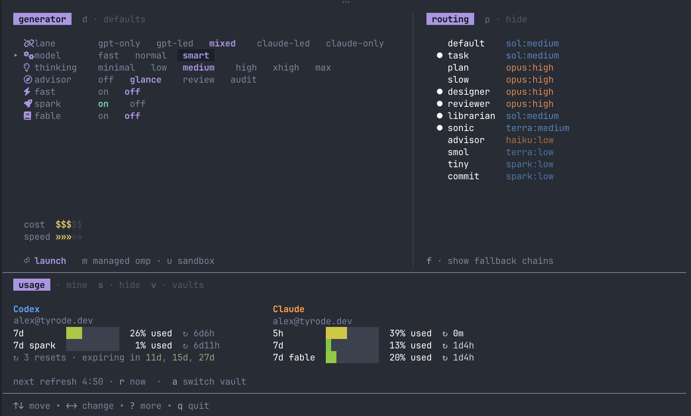

# code

> Everyone's PATH has room for exactly one `code`. If you, too, never plan to
> run VS Code again — the name just freed up.



`code` is a launch pad for [oh-my-pi](https://github.com/can1357/oh-my-pi),
the AI coding agent. Instead of starting every session on the same defaults,
you dial in what the task in front of you actually needs:

- **generator** — a few dials: which model pool, how capable a model, how much
  thinking, how much reviewing.
- **routing** — a live preview of exactly which model would handle which role
  with the current dials.
- **usage** — your provider quotas at a glance, so you spend the scarce
  buckets on purpose.

Press `enter` and `code` launches oh-my-pi with that setup, as a one-shot
overlay — your omp config is never modified.

It's made for people who run oh-my-pi with **both Anthropic and OpenAI**:
the whole point is deciding, per task, how to blend the two pools and which
quota to spend. With a single provider you can still launch, but the dials
lose most of their meaning.

Too lazy to dial? Press `ctrl+o` and describe the task: a small local model
rates its difficulty and sets the dials for you. (Optional — needs
[ollama](https://ollama.com); everything else works without it.)

## Install

```
go install github.com/atyrode/code@latest
```

or grab a [release binary](https://github.com/atyrode/code/releases).

You need [oh-my-pi](https://github.com/can1357/oh-my-pi) (`omp`) installed —
`code` launches it, it doesn't replace it.

Then, once:

```
code generate init   # reads your omp's model list, scaffolds a models file
code generate        # renders the routing catalog the dials browse
```

Review the tier guesses `init` makes in the models file (it tells you where),
re-run `code generate` after any edit, and you're set: run `code`.

## More

- [Configuration](docs/configuration.md) — every key and environment variable
- [Status & caveats](docs/status.md) — what works out of the box, what is
  still shaped by the author's setup, and where this is going

[MIT](./LICENSE) — extracted from
[atyrode/dotfiles](https://github.com/atyrode/dotfiles).
