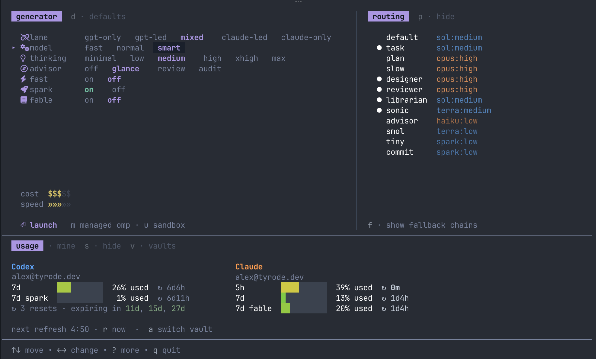

# code

**Mission control for your coding agents.**

> There can only be one `code` on your machine. If you, too, never plan to
> run VS Code again — the name just freed up.



`code` is a launch pad for [oh-my-pi](https://github.com/can1357/oh-my-pi),
the AI coding agent. Instead of starting every session on the same defaults,
you dial in what the task in front of you actually needs:

- **generator** — a few dials: which model pool, how capable a model, how much
  thinking, how much reviewing.
- **routing** — a live preview of exactly which model would handle which role
  with the current dials.
- **usage** — your provider quotas at a glance, so you spend the scarce
  buckets on purpose.

Press `enter` and `code` launches oh-my-pi with that setup, as a one-shot
overlay — your omp config is never modified.

It's made for people who run oh-my-pi with **both Anthropic and OpenAI**:
the whole point is deciding, per task, how to blend the pools and which
quota to spend. A DeepSeek API key adds a third, pay-as-you-go pool — its
own `ds` lanes and a live balance readout in Usage. With a single provider
you can still launch, but the dials lose most of their meaning.

## Usage

```bash
code
```

That's the whole manual. Dial what the task needs, press `enter`, and you're
in an oh-my-pi session routed exactly as previewed.

Everything after `code` belongs to oh-my-pi — it's carried verbatim into the
session you launch:

```bash
code "fix the failing tests"   # launches omp with that as its first message
code --continue                # dial, then pick up your last omp session
```

A few words `code` keeps for itself: `generate` (the [catalog
subcommand](docs/configuration.md)), `session` and its `ls` shorthand,
`worktree` and its `wt` shorthand, and `--profile` (routing is code's job — a
forwarded `--profile` is replaced).

Every session you launch is recorded while it runs, so the ones you walked away
from are findable rather than merely suspected:

```bash
code ls                                 # live sessions, then this repository's saved ones
code session reap --superseded          # dry run: what is on a stale build
code session reap --older-than 3d --yes # retire them, whole process tree
```

Inside a repository, `code ls` also lists the omp sessions saved from any of
its worktrees — the current directory's first, then the rest of the repository
— each marked `live` when a recorded session is running it and `interrupted`
otherwise. Only the transcript headers (id, directory, title, timestamp) are
read; the conversation never is.

`reap` prints and exits unless you pass `--yes`, and always takes the session's
whole process tree — language servers, browsers, and workers included, so they
are not orphaned onto init while still holding their memory.

Inside a repository, press `w` before launching to start the session on a fresh
`code/<adj>-<color>-<animal>` branch in its own linked worktree. The toggle is
off by default. A pristine worktree is removed when the session exits; changes
or commits keep it for recovery:

```bash
code wt                    # list session worktrees, their state, and their saved sessions
code wt resume <name|id>   # continue a saved session in the worktree it ran in
code wt remove <name>      # remove an idle, pristine worktree
code wt prune              # dry-run cleanup; add --yes to remove
```

A session whose process was killed — the terminal closed, the machine
rebooted — is still on disk, and `code wt` shows it under its worktree with its
id, title, and last activity. `code wt resume` takes the worktree's name (when
it holds one session) or the session id, and launches `omp --resume <id>` in
that directory the way `code` launches any trusted session: same launcher,
same auth environment, same registry record. Two sessions in one tree, or a
prefix shared by several ids, are listed and refused until you name one; a
tree that no longer exists is reported rather than recreated; uncommitted
changes are left where they are.

Worktrees are created under `code`'s own state root —
`$XDG_STATE_HOME/code/wt`, or `$HOME/.local/state/code/wt`, relocatable with
`CODE_WORKTREE_DIR`. They deliberately do **not** live in omp's `~/.omp/wt`:
`omp worktree clear --all` force-deletes everything there and has no view of
`code`'s session registry, so a live session's tree used to be one command away
from deletion. Worktrees an older build left in omp's directory are still
listed, with their `ROOT` column marked `legacy`, and `code wt rm` retires them
— see [configuration](docs/configuration.md#state-on-disk).

## The engine

`code engine` is what a supervising program — [Babel](https://github.com/atyrode/babel)
is one — runs when it needs a contained, credentialed omp it did not configure
itself. stdin and stdout are omp's own `--mode rpc` protocol, forwarded byte
for byte; Code adds nothing to it and reads nothing out of it. What Code
contributes is the profile the session launches under, the provider
credential it authenticates with (redacted from every forwarded byte), the
sandbox it runs inside, and a runtime report beside the stream:

```bash
code engine --profile code --runtime-info /run/user/1000/job/runtime.json
                                        # native omp RPC on stdio; the report
                                        # (schema code.runtime/1) is written before
                                        # the first byte and rewritten with the exit
                                        # status and resource use after the last
code engine --describe --profile code@3 # the report's profile half, no launch
code engine --configure --result-file P # mint a profile revision on your terminal
code engine --import-profiles DIR       # carry an older profile store over, verbatim
```

A profile is an immutable revision an operator confirmed in Code's own dial UI;
no flag or environment variable sets one. Closing stdin ends the run and tears
the whole process tree down.

The supported native engine runtime is the OMP release pinned in
[`nix/omp.nix`](nix/omp.nix), used by both `#with-omp` and required PR CI.
Code uses OMP's native `--mode rpc`, `--no-tools` and discovery-disabling flags, together
with a disposable HOME and empty working directory. For contained launches,
the OS sandbox constrains mounts and creates the working directory as an empty
tmpfs; the private directories alone are not containment. These properties,
not `--no-tools` alone, keep ambient tools out of the measured startup registry.

OMP's SDK has a restricted-session option (`restrictToolNames`), but the
CLI/RPC exposure Code needs remains tracked in
[#124](https://github.com/atyrode/code/issues/124). The pin and required canaries
do not implement that upstream API. Code does not filter OMP's registry or add
a client-specific protocol; native RPC and OS containment retain their owners.

## Features

- **Dials, not config files** — a provider **lead** dial with a led/only
  blend child (scales past two pools without overflowing), notched sliders
  for model tier and thinking depth, advisor level, plus the spark toggle;
  every combination maps to a pre-computed routing. Optional pools plug in
  as their own lanes. The model slider's top notch, **elite**, appears only
  on lanes whose lead pool ladders to a fourth rung — a provider's best
  model (`claude-fable-5`, `gpt-6-astra`) — and is simply absent where that
  would duplicate `smart`.
- **omp's own switches, behind a fold** — a `more` row at the end of the
  dial list opens onto `fast` (a provider's priority service tier), `prewalk`
  (hand the run to the cheap `smol` role at the first edit once the plan's
  todo list exists), `planyolo` (start read-only in plan mode, auto-approve,
  then implement) and `fallback` (on by default; off keeps every role on its
  lead — omp's model fallback, not the account fallback). All four are omp
  features; this tool only puts the value where omp reads it — an overlay
  key or an argv flag — so none of them changes the routing grid. The row
  stays closed until you open it, and names any switch turned behind it.
- **Hosted or local** — an optional runtime broker can advertise only the local
  targets this machine supports; selecting one delegates first-use setup and
  launch without mixing cloud credentials into the session. The engine's
  configuration ceremony (`code engine --configure`) adds a **local model** dial
  when a loopback OpenAI-compatible daemon answers — [ollama](https://ollama.com),
  llama.cpp, LM Studio, oMLX (`CODE_OLLAMA_ENDPOINT` relocates it): every tag it
  serves is offered, the profile it mints needs no API key and costs nothing, and
  a contained analysis reaches the daemon through the sandbox's own relay rather
  than the network. The dial exists nowhere else, so nothing but an operator at
  the dials can put a local model into a supervised run.
- **Live preview** — see which model leads every role, and its fallback
  chain, before anything runs.
- **One-shot overlays** — each launch is an ephemeral `--config`; your omp
  configuration is never written.
- **Prompt → profile** — `ctrl+o`, describe the task, a small local model
  rates its difficulty and sets the dials (optional, needs
  [ollama](https://ollama.com); the prompt is forwarded into the session).
  Suggestions are quota-aware: a lane whose lead pool is maxed falls to a
  sibling with headroom, and a low DeepSeek balance stops proposals from
  spending it.
- **Usage at a glance** — quota bars and reset countdowns per provider,
  before you spend the scarce bucket.
- **Account presets** — choose broker accounts, add OAuth logins, and save reusable selections (`v`).
- **Cost & speed meters** — every dial change reprices the session; DeepSeek
  rungs are priced by the clock during its off-peak discount window.
- **Guided first run** — no catalog? `code` builds one from your omp,
  interactively; `code generate` scripts the same thing.
- **Argument passthrough** — `code <anything omp understands>` just works.

## Install

**Grab a [release binary](https://github.com/atyrode/code/releases)** — one
static file, nothing else to install:

```
curl -fsSL https://github.com/atyrode/code/releases/latest/download/code-linux-amd64.tar.gz | tar xz code
```

(swap `linux-amd64` for `linux-arm64`, `darwin-amd64`, or `darwin-arm64`)

**Or with Nix** — the same binary, with oh-my-pi bundled if you want it:

```
nix run github:atyrode/code            # just code
nix run github:atyrode/code#with-omp   # code + a pinned omp on PATH
```

Dotfiles owns OMP's **managed machine runtime and configuration**. Code's
`#with-omp` is only an optional standalone bundle, not a replacement for the
dotfiles wrapper or a second deployment authority. The repositories have no
cross-repository build dependency: update and verify each pin explicitly.
`CODE_OMP` still selects the configured runtime that Code actually launches.
Older OMP releases are not compatibility targets; Code no longer probes for
pre-17.3 settings support. In particular, the explicit `audit` advisor dial
always enables advising for spawned `task` agents, including saved audit
profiles; it no longer depends on a startup probe finishing first.

**Or, for Gophers:** `go install github.com/atyrode/code@latest`

Unless you took `#with-omp`, you need
[oh-my-pi](https://github.com/can1357/oh-my-pi) (`omp`) installed—`code`
launches it, it doesn't replace it. Authenticate locally with
`omp auth-broker login <provider>`. For a canonical broker on another machine,
set `CODE_AUTH_LOGIN_VIA=user@host`; the account manager's `v` → `a` flow then
runs the same interactive login over SSH and refreshes the account list.
Enabled accounts form a pool omp rotates through, not a pick: the account
manager and the launch both print the exact pool per provider, and judge each
account against the tier the selected model draws (a `tier:fable` block keeps
an account off Fable while the rest of Anthropic stays available, and the
warning says so). When a broker cooldown outlives an upstream quota reset —
fresh usage shows headroom while the block stands — that is reported as stale
broker state, not exhaustion: highlight the blocked account and press `x` to
clear its remembered blocks and refresh live usage; a continuing upstream
limit recreates the block on the next request.
API-key providers are broker writes rather than OAuth logins; the
[atyrode dotfiles](https://github.com/atyrode/dotfiles) expose the secure
`atyrode auth broker add-api-key <provider>` route.

Required [CI](.github/workflows/ci.yml) builds the bundled OMP derivation and
sets `CODE_TEST_REQUIRE_OMP=1` and `CODE_OMP_SMOKE=1`: a missing binary is a
failure, not a skip. `TestOmpSmoke` checks generated config values read back
from real OMP, JSON schemas and the upstream role inventory. The native
tool-registry canaries in `omptools_test.go` separately require an empty startup
registry and plant a discoverable MCP server whose tool must be enumerated, so
an empty or missing enumeration cannot pass vacuously. No model call or real
credential is needed. To run the same local gate:

```bash
nix build .#omp
PATH="$PWD/result/bin:$PATH" CODE_TEST_REQUIRE_OMP=1 CODE_OMP_SMOKE=1 CODE_REQUIRE_SANDBOX=1 scripts/gate.sh
```

The containment scenarios also require bubblewrap and a user systemd session.
Without the required flags, local runs loudly skip unavailable prerequisites.
Separately, omp releases near-daily and ignores overlay keys it no longer
knows, so the weekly [`omp-smoke.yml`](.github/workflows/omp-smoke.yml) checks
configuration/schema drift against the **latest upstream** release and opens
an `omp-drift` issue on failure. It does not advance the bundled pin or replace
the required pinned-runtime canaries.

To verify the **deployed configured OMP wrapper** without introducing a Code
source build into dotfiles, compile this repository's smoke runner once, then
run it against the package or installed wrapper being qualified:

```bash
# From this Code checkout; keep this cwd for the testdata catalog.
go test -c -o /run-owned/code-omp-smoke .
CODE_OMP=/absolute/path/to/configured-omp/bin/omp CODE_OMP_SMOKE=1 \
  /run-owned/code-omp-smoke -test.run '^TestOmpSmoke$' -test.v -test.timeout=5m
```

Choose a private run-owned output directory in place of `/run-owned` and remove
the runner afterwards. The runner replaces HOME, PI and XDG state locations and
clears credential variables. Its config check writes the real generator's
audit/fast/prewalk overlay to that private config home and compares every leaf
with `omp config list --json`, not merely an exit status. This is configured-OMP
schema evidence, not evidence that the deployed **Code** wrapper reaches an
interactive session: dotfiles owns the complementary packaged Code/OMP PTY
startup and argument/config-layer checks. Neither smoke activates a machine or
advances a pin. Native containment still requires the separate canaries above.

Then just run `code`. The first run notices there's no routing catalog yet
and walks you through building one from your omp's model list — it shows you
which model it picked for each rung, you sanity-check, press enter, done.
That guided run is for plain installs: the
[dotfiles](https://github.com/atyrode/dotfiles) wrapper always exports
`CODE_GENERATED` at a pre-baked catalog, so `code` never offers to build one
there — you re-render with `code generate` instead.

The same machinery is scriptable as `code generate init` (scaffold the models
file) and `code generate` (re-render the catalog after you edit it).

## More

- [Configuration](docs/configuration.md) — every key and environment variable
- [Status & caveats](docs/status.md) — what works out of the box, what is
  still shaped by the author's setup, and where this is going
- [Manifold transition](docs/manifold-transition.md) — the direction: `code`
  as a manifold plugin, the decisions, the steps, and what manifold still lacks

[MIT](./LICENSE) — extracted from
[atyrode/dotfiles](https://github.com/atyrode/dotfiles).
